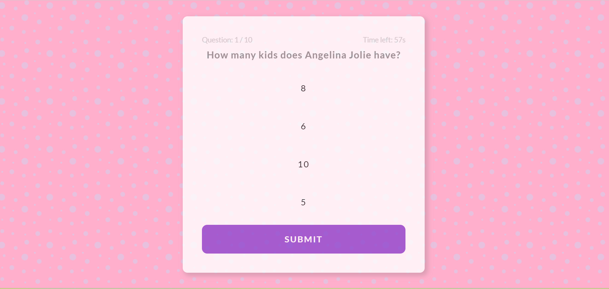

# Pop Culture Quiz
## Index - Table Of Contents
1. [General Information](#general-info)
2. [User Experience & Design](#ux)
3. [Features](#features)
4. [Technologies Used](#tech-used)
5. [Testing](#testing)
6. [Deployment](#deployment)

## General Information

This is a challenging quiz that tests the clients pop culture knowledge. When deciding a concept for this project, I decided to create a quiz that incorporates a topic that I am familiar with. This made it easy for me to create questions and answers that I didn't have to spend time researching.

The website contains all of the classic elements of a quiz - a series of multiple choice answers, a timer, and a user score that displays once all of the questions have been answered.

 ## User Experience

 **Site Goals**

 1. As A User

 * I want to test my knowledge on celebrity pop culture.
 * I want the quiz to be visually appealing and easy to navigate.
 * I want to be entertained.
 * I want the website to be responsive on whichever device I am playing it on.
 * I want to immediately have an understanding of the site's purpose.

2. As The Site Administrator

* I want the website to load fast.
* I want to utilise interactive elements to ensure client engagement.
* I want to create an attractive website that is pleasing to the consumer.
* I want the website to be fully responsive across all devices.
* I want to ensure the quiz works as intended to, loading each question accordingly, incrementing the score properly and the timer works effeciently.
* I want the client to be able to navigate through the website easily and ensure the quiz is straightforward and simple to use.

## Design

*Imagery*

* When brainstorming ideas for this project, I decided that imagery would not play an important part in this project. I wanted a simple, clean layout, ensuring users could focus on the quiz and not be distracted by loud, brash images.

* So instead of using a background image, I opted for a pattern instead. I found [this website](https://heropatterns.com/) and came across the chosen pattern. The pattern is bubbly and fun and fits the entertainment element of the website. It is only visible when playing the quiz and it is discreet yet quite pretty.

* The background is a bubble-gum pink which feels playful and fun. The pale purple compliments the pink and is not too distracting for the user, yet it is a nice touch.

*Colour Scheme*

* When deciding what colours would suit the quiz, I researched [the colour feelings](https://99designs.com/blog/tips/how-color-impacts-emotions-and-behaviors/). I knew the colours had to be lighthearted and fun, hence why I chose the pink. The light purple envokes calm and soothing moods. I wanted the quiz to be challenging but at the same time enjoyable for the user and not too overwhelming. Adding the purple achieves this perfectly. The bright purples are energising colours and ensure the buttons stand out on the webpage.

* I browsed [the coolors website](https://coolors.co/) to try and find a pink and purple palette that matched what I had envisioned for my website. When I couldn't find one I liked I made my own, that has the perfect shades to meet the tones I intended to add throughout the webpage.

*Typography*

* When choosing a typography, I knew I had to have two different fonts. I wanted one font for the website's title, that was fun and endearing and I came across the [Fuzzy Bubbles font](https://fonts.google.com/specimen/Fuzzy+Bubbles) and chose to include it. 

* For the rest of the quiz, specifically the quiz questions, I needed a font style that was more serious and legible. Given that the quiz has a timer, I wanted to make sure the user could read the questions and answers quickly and not be detered by a busy font. I found the [Lato font](https://fonts.google.com/specimen/Lato) and given it's simple style, I decided to choose it.

*Wireframes*

  

 ## Features

 

 ## Technologies Used

 **Languages Used**

 * [HTML5](https://en.wikipedia.org/wiki/HTML5)
 * [CSS3](https://en.wikipedia.org/wiki/CSS)
 * [Javascript](https://en.wikipedia.org/wiki/JavaScript)

 **Frameworks, Libraries & Programs Used**

* [The colour feelings helped me to choose the colours included in the website](https://99designs.com/blog/tips/how-color-impacts-emotions-and-behaviors/)

* [I used google fonts when styling the text of the website](https://fonts.google.com/)

* [I used this free pattern picker to style the background of my quiz section](https://heropatterns.com/)

* [I used the favicon generator to create my favicon](https://favicon.io/favicon-generator/)

* [I used the coolors website to create my own colour palette](https://coolors.co/)

* I utilised O Reilly Javascript The Definitive Guide Seventh Edition Book to research certain topics for the quiz. 
Chapter 7 Iterating Arrays pages 162-164
Chapter 11 Timers Pages 323-324

 

## Testing

I have conducted the compulsory tests in order to ensure the website works effectively.

**Validator Testing**

* Results for HTML

* Results for CSS

* Results for Javascript

* Results for Accessibility

**Browser Compatibility**

Testing has been executed on the following browsers:

 1. Chrome Version 110.0.5481.178 (Official Build) (64-bit)
 2. Firefox Version 110.0.1 (64-bit)
 3. Safari on iOS Version 16.3
 4. Microsoft Edge Version 110.0.1587.63 (Official build) (64-bit)

 **Responsive Testing**

**Original Design Concept**

My original design idea varies drastically to the end product. I began my first attempt at the project feeling quite muddled and overwhelmed. My javascript code felt very disjointed and confusing. The questions variable was nested to an unnecessary extent making it difficult to work with. A lot of the code was copy and pasted from different sources and in the end I ended up with a script.js file that I couldn't really understand. I found myself extremely frustrated and knew that I couldn't possibly hand up a project I wasn't proud of.

I decided to scrap the original project in the end and start from scratch. I researched extensively on youtube to try and break down the javascript in a way I could understand. I found excellent resources on youtube that really helped me to approach the new project from a simplified viewpoint. 

[Coding along with videos like this one really aided in helping me understand the javascript concepts](https://youtu.be/aroYjgQH8Tw)

[This free youtube javascript course reinforced the topics needed to create my project](https://youtu.be/PkZNo7MFNFg)

[This youtube course was also very insightful](https://youtu.be/jS4aFq5-91M)

[The first scrapped project can be found here](https://erincunningham7.github.io/project-portfolio-two-original/)

/*Testing items

start button - console.log
when a user clicked on an input that it was being stored - console log
submit btn - check user answer
reload quiz btn
timer
check score was being stored 
test timer */

 

 ## Deployment

 *Version Control*

 * The site was created using the Code ASnywhere editor and pushed to github to the remote repository 'project-portfolio-two-'.

 * The following git commands were utilised regularly throughout development to push code to the remote repository:

1. git status - This command displayed the modified files that needed to be pushed to the remote repository.

2. git add <filename> - This command was used to add the files to the staging area before they are committed.

3. git commit -m “commit message” - This command was utilised to commit changes to the local repository queue ready for the final step.

4. git push - This command was applied to push all committed code to the remote repository on github.

 *The site was deployed to GitHub pages. The following steps guide us through that process*

 1. In th GitHub repository, find the "Settings" tab, scroll down the menu on the left-hand side until you reach "Pages" and click it.

 2.  Under the "Build and Deployment" section you will see a source heading. From the drop down menu, select the "main" option.

 3. Click save.

 4. The page will automatically update and display "Your site is live at ..."  and from there you can click Visit Site to see your finsihed product!

 [The live link can be found here](https://erincunningham7.github.io/project-portfolio-two-/)

*Clone The Repository Locally*

1. In the GitHub repository you want to clone locally, find the 'Code' tab and click on it.

2. Click on HTTPS.

3. Copy the repository link to the clipboard.

4. Open your IDE of choice.

5. Type git clone copied-git-url into the IDE terminal.

6. The project will successfully be cloned on your local machine for use.

