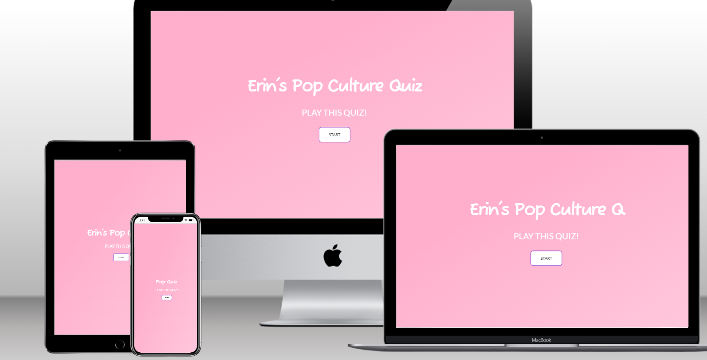
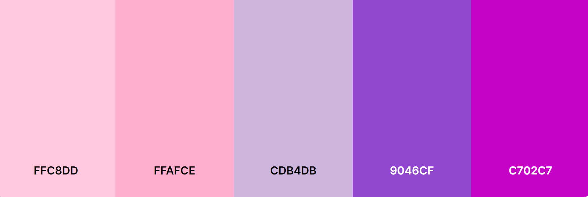
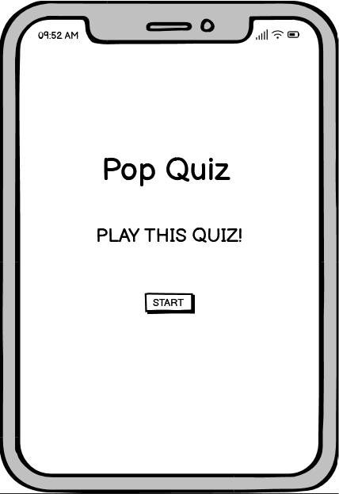
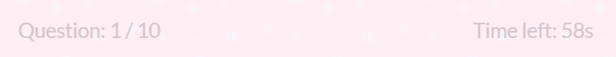
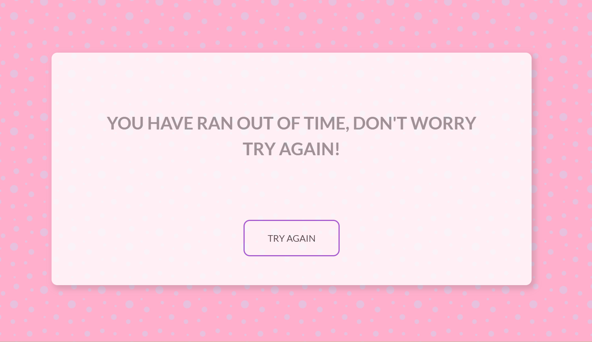
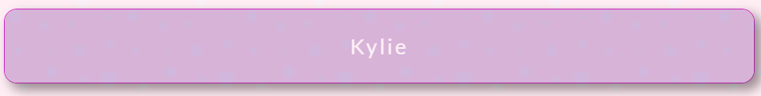
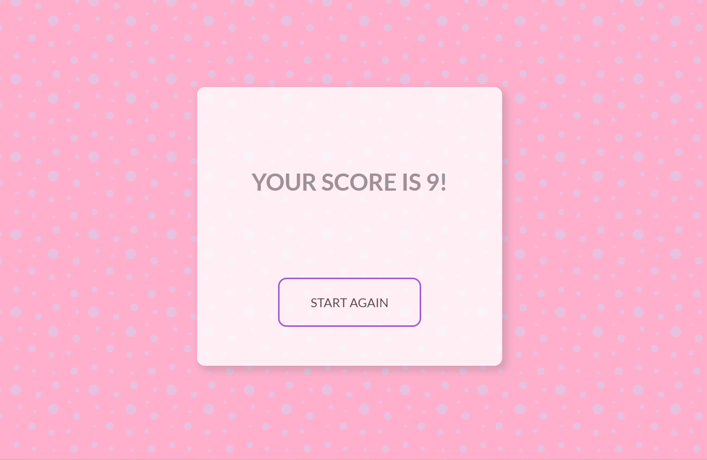

# Erin's Pop Culture Quiz
## Index - Table Of Contents
1. [General Information](#general-info)
2. [User Experience & Design](#ux)
3. [Features](#features)
4. [Technologies Used](#tech-used)
5. [Testing](#testing)
6. [Deployment](#deployment)

## General Information

This is a challenging quiz that tests the clients pop culture knowledge. When deciding a concept for this project, I decided to create a quiz that incorporates a topic that I am familiar with. This made it easy for me to create questions and answers that I didn't have to spend time researching.

The website contains all of the classic elements of a quiz - a series of multiple choice answers, a timer, and a user score that displays once all of the questions have been answered.

During the making of this project I covered a fair amount of javascript topics. Firstly, I learned how to get elements from the DOM whether that be through id or query selector. I practiced using event listeners initially with click events and then advancing to mouseenter and mouseleave events. I created HTML elements using the createElement in javascript too. I even mastered how to create a timer, which I thought I would never be able to do going into the project. I also learned how to clear the user input just to really give the quiz website that professional feeling for the user.

I proudly extended my current CSS skills. Considering I struggled a lot in my previous project with responsiveness, I decided to work with ems, rems and percentages where possible and in the end that saved me considerable stress and constant tweaking when it came to making media queries. I utilised keyframes animations, transform properties and transition effects. So the knowledge I have gained throughout this project has been extensive and I am extremely proud of how much my abilities have progressed.

 ## User Experience

 **Site Goals**

 1. As A User

 * I want to test my knowledge on celebrity pop culture.
 * I want the quiz to be visually appealing and easy to navigate.
 * I want to be entertained.
 * I want the website to be responsive on whichever device I am playing it on.
 * I want to immediately have an understanding of the site's purpose.

2. As The Site Administrator

* I want the website to load fast.
* I want to utilise interactive elements to ensure client engagement.
* I want to create an attractive website that is pleasing to the consumer.
* I want the website to be fully responsive across all devices.
* I want to ensure the quiz works as intended to, loading each question accordingly, incrementing the score properly and the timer works effeciently.
* I want the client to be able to navigate through the website easily and ensure the quiz is straightforward and simple to use.

## Design

*Imagery*

* When brainstorming ideas for this project, I decided that imagery would not play a major part in this project. I wanted a simple, clean layout, ensuring users could focus on the quiz and not be distracted by loud, brash images.

* So instead of using a background image, I opted for a pattern instead. I found [this website](https://heropatterns.com/) and came across the chosen pattern. The pattern is bubbly and fun and fits the entertainment element of the website. It is only visible when playing the quiz and in the 404 error page. It is discreet yet quite pretty.

* The background is a bubble-gum pink which feels playful and fun. The pale purple compliments the pink and is not too distracting for the user, yet it is a nice touch.

*Colour Scheme*

* When deciding what colours would suit the quiz, I researched [the colour feelings](https://99designs.com/blog/tips/how-color-impacts-emotions-and-behaviors/). I knew the colours had to be lighthearted and fun, hence why I chose the pink. The light purple envokes calm and soothing moods. I wanted the quiz to be challenging but at the same time enjoyable for the user and not too overwhelming. Adding the purple achieves this perfectly. The bright purples are energising colours and pop nicely when hovered over.

* I browsed [the coolors website](https://coolors.co/) to try and find a pink and purple palette that matched what I had envisioned for my website. When I couldn't find one I liked I made my own, that has the perfect shades to meet the tones I intended to add throughout the webpage.

*Typography*

* When choosing a typography, I knew I had to have two different fonts. I wanted one font for the website's title, that was fun and endearing and I came across the [Fuzzy Bubbles font](https://fonts.google.com/specimen/Fuzzy+Bubbles) and chose to include it. 

* For the rest of the quiz, specifically the quiz questions, I needed a font style that was more serious and legible. Given that the quiz has a timer, I wanted to make sure the user could read the questions and answers quickly and not be detered by a busy font. I found the [Lato font](https://fonts.google.com/specimen/Lato) and given it's simple style, I decided to choose it.

*Wireframes*

* Quiz Intro Wireframe

* Quiz Container Wireframe

* Tablet Wireframe

* Mobile Wireframe

  

 ## Features

 **Existing Features**

 **F01 Quiz Intro**

 * The quiz introduction grabs the user's attention from the get go. The title's text automatically types across the screen when the page loads. This feature helps to enhance the look of the site and improves the overall user experience. It is extremely eye-catching and animated. The font is fun and informal and conveys the intended easy-going mood. On mobile, the title is smaller, as the long title takes up too much screen space, the smaller title works better and without the animation.

 * I made the decision to include my name in the title as the quiz itself is farcical, it adds to the free-and-easy feeling of the quiz.

 * The start button appears distinctly and allows the client to navigate to the quiz instantaneously. When the client hovers over the button it displays an interactive hover element.

 * The bubblegum pink background is whimsical and lighthearted and  ensures the text on the screen is legible to the user.

 

 **F02 Timer & Question Counter**

 * In order to make the quiz more challenging I decided to include a timer to the quiz section. The timer gives the user 60 seconds to complete the quiz. The question counter displays the current question number out of ten. They are both informative pieces of information but as they are tertiary in relation to visual hierarchy they appear lighter in colour compared to the question and answer font.

 
 
 * If the user runs out of time, they have the option to try again. The timer adds another entertaining aspect to the site.

**F03 Quiz Questions & Answers**

* The quiz section displays the ten chosen questions and answers in a clear, legible font. The user has a choice of four possible answers.

* This section has interactive elements to engage the client and make the quiz itself more enjoyable. When the user hovers over an answer, a purple border appears around said answer, along with the text turning purple too. The chosen colour coincide with the website's colour palette.

* When the client clicks their chosen answer, another interactive element appears. The background of the answer turns purple and the text changes to white. This was implemented to keep the user engaged and stay on the site for longer.

* The background of the quiz section enforces the carefree, happy mood that I wanted users to feel when they play the quiz. The bubble pattern is fun and aesthetically pleasing to look at, and looks pretty with the opacified container.

* The content of the quiz evidently relates to the title. All the questions and answers test the user's celeb knowledge and stay on topic throughout.

**F04 Score**

* Once the player has answered all questions they recieve their score once the quiz ends. The user has the option to restard the quiz if they like.

* The start again button is interactive too, like the start button seen in the welcome introduction of the quiz.

**F05 Favicon**

* The favicon for this website utilises the bubblegum pink that is visible throughout the quiz. The "POP" font is amusing and enjoyable. 

* The use of this favicon enables users to locate the website quickly, as it appears on bookmarks, history archives, browser tabs etc. and as a result increase user engagement.

**F06 404 Error Page**

* The error 404 page was added if it so happens that the site link is broken.

* It has a button that gives the user the option to return to the homepage.

* It is styled in correspondance with the overall site design. It contains the fun bubble pattern background that appears in the quiz section.

**F07 Submit Button**

* The submit button moves users seemlessly to the next question. It contains a special interactive feature that could easily be overlooked. When the user's mouse glides over the button, depending on what side they enter from, the colour transforms effortlessly to a paler purple colour, with the text turning black. The effect is subtle but extremely satisfying. 

 

 ## Technologies Used

 **Languages Used**

 * [HTML5](https://en.wikipedia.org/wiki/HTML5)
 * [CSS3](https://en.wikipedia.org/wiki/CSS)
 * [Javascript](https://en.wikipedia.org/wiki/JavaScript)

 **Frameworks, Libraries & Programs Used**

* [The colour feelings helped me to choose the colours included in the website](https://99designs.com/blog/tips/how-color-impacts-emotions-and-behaviors/)

* [I used google fonts when styling the text of the website](https://fonts.google.com/)

* [I used this free pattern picker to style the background of my quiz section](https://heropatterns.com/)

* [I used the favicon generator to create my favicon](https://favicon.io/favicon-generator/)

* [I used the coolors website to create my own colour palette](https://coolors.co/)

* [Techsini aided me in creating the collage of my webpage on multiple devices](https://techsini.com/multi-mockup/index.php)

* [I used this javascript validator](https://www.htmlstrip.com/javascript-validator)

* [I used this css validator](https://jigsaw.w3.org/css-validator/validator.html.en)

* [I used this html validator](https://validator.w3.org/)

* [I researched visual hierarchy to give my website a cleaner finish than my previous project](https://www.interaction-design.org/literature/topics/visual-hierarchy)

* [I searched the web for mouseenter and mouseleave events to make my submit button](https://www.telerik.com/blogs/angular-basics-how-to-use-angular-mouseenter-event#:~:text=The%20mouseleave%20event%20is%20triggered%20when%20our%20mouse,to%20%E2%80%9Cbar%2C%E2%80%9D%20we%20see%20that%20it%20turns%20green.)

* [This website helped me understand how to create the effect on the submit button](https://medium.com/weekly-webtips/create-button-ripple-effect-with-pure-css-and-javascript-d862cad48f54)

* I utilised O Reilly Javascript The Definitive Guide Seventh Edition Book to research certain topics for the quiz. 

    1. Chapter 7 Iterating Arrays pages 162-164

    2. Chapter 11 Timers Pages 323-324

* I referenced Sams Teach Yourself Web Development In One Hour Book too, particularly the following:

    1. Lesson 12 Designing Forms
    
    2. Lesson 22 Designing For Mobile Web

 

## Testing

I have conducted the compulsory tests in order to ensure the website works effectively.

**Validator Testing**

* Results for HTML

* Results for CSS

* Results for Javascript

**Browser Compatibility**

Testing has been executed on the following browsers:

 1. Chrome Version 110.0.5481.178 (Official Build) (64-bit)
 2. Firefox Version 110.0.1 (64-bit)
 3. Safari on iOS Version 16.3
 4. Microsoft Edge Version 110.0.1587.63 (Official build) (64-bit)

 **Responsive Testing**

 The website was tested on multiple screen sizes and thankfully it is fully responsive.

1. Open browser and navigate to Erin's Pop Culture Quiz.
2. Open the developer tools (right click and inspect).
3. Set to responsive and decrease width to 320px
4. Set the zoom to 60%
5. Click and drag the responsive window to maximum width

Expected:

Website is responsive on every varying screen size. The text is not too big for the screen. The bubble pattern can still be seen on the quiz section.

Actual:

Website behaved as expected.

 
 **Accessibility Testing**

 Testing was centred around the following:

 * The website contains no contrast errors that may affect visually impaired users.

* The language of the page has been identified.

Accessibility Issues:

1. Contrast errors occured in the Start and Submit buttons. Once this problem was established I darkened the background colour of the buttons.

* Results for Web Accessibility Evaluation

**Functional Testing**

*Start Button*

* Testing was ran on the start button to insure the button does it's intended task - hides the intro section and starts the quiz timer. This was assessed by using console.log to ensure the correct element had been taken from the dom, and then going directly to the site to press the start button.

* The start button worked as intended.

*Storing User Input*

* In order for the quiz to work correctly, it was important that the user's inputted answers are being stored correctly. Console log was used yet again, to ensure the answer being clicked was being documented.

* The user input was being stored correctly.

*Submit Button*

* The purpose of the submit button is to move to the next question and check the user's answers. Console log aided me yet again, to check the selected answer was being stored and the score updating accordingly. I also clicked the button on the live site to make sure it moved to the next question and eventually to the score section.

* The submit button was worked as intended.

*Try Again Button*

* When the timer runs out, the user has an option to reload the quiz. Testing was carried out on this button by letting the timer run out on the live site, and clicking the button once it appears to see if it takes the user back to the welcome introduction.

* The try again button worked as intended.

*Start Again Button*

* When the user finishes the quiz and has submitted all answers on time, their score is displayed but they have the option to start the quiz again. In order to test this button I quickly answered the quiz questions and once I had recieved my score, pressed the button to see if it takes the user back to the welcome introduction.

* The start again button worked as intended.

*Timer*

* The timer required considerable tedious testing to try and implement it correctly. To assess it's functionality, I would press the Start button to begin the quiz, watch the timer as it decreases and see if it stops at 0.

* The timer did not work as intended, so I checked over my javascript code and realised the function was called in the wrong place and the clearInterval needed to be called with the correct parameter.

*Score*

* The score needs to update according to the user's input. To check this was working appropriately I would answer the questions and alert the score once the quiz had ended.

* The score worked as intended.

**Original Design Concept**

My original design idea varies drastically to the end product. I began my first attempt at the project feeling quite muddled and overwhelmed. My javascript code felt very disjointed and confusing. The questions variable was nested to an unnecessary extent making it difficult to work with. A lot of the code was copy and pasted from different sources and in the end I ended up with a script.js file that I couldn't really understand. I found myself extremely frustrated and knew that I couldn't possibly hand up a project I wasn't proud of.

I decided to scrap the original project in the end and start from scratch. I researched extensively on youtube to try and break down the javascript in a way I could understand. I found excellent resources on youtube that really helped me to approach the new project from a simplified viewpoint. 

[Coding along with videos like this one really aided in helping me understand the javascript concepts](https://youtu.be/aroYjgQH8Tw)

[This free youtube javascript course reinforced the topics needed to create my project](https://youtu.be/PkZNo7MFNFg)

[This youtube course was also very insightful](https://youtu.be/jS4aFq5-91M)

[The first scrapped project can be found here](https://erincunningham7.github.io/project-portfolio-two-original/)

 ## Deployment

 *Version Control*

 * The site was created using the Code Anywhere editor and pushed to github to the remote repository 'project-portfolio-two-'.

 * The following git commands were utilised regularly throughout development to push code to the remote repository:

1. git status - This command displayed the modified files that needed to be pushed to the remote repository.

2. git add . - This command was used to add the modified files to the staging area before they are committed.

3. git commit -m “commit message” - This command was utilised to commit changes to the local repository queue ready for the final step.

4. git push - This command was applied to push all committed code to the remote repository on github.

 *The site was deployed to GitHub pages. The following steps guide us through that process*

 1. In th GitHub repository, find the "Settings" tab, scroll down the menu on the left-hand side until you reach "Pages" and click it.

 2.  Under the "Build and Deployment" section you will see a source heading. From the drop down menu, select the "main" option.

 3. Click save.

 4. The page will automatically update and display "Your site is live at ..."  and from there you can click Visit Site to see your finsihed product!

 [The live link can be found here](https://erincunningham7.github.io/project-portfolio-two-/)

*Clone The Repository Locally*

1. In the GitHub repository you want to clone locally, find the 'Code' tab and click on it.

2. Click on HTTPS.

3. Copy the repository link to the clipboard.

4. Open your IDE of choice.

5. Type git clone copied-git-url into the IDE terminal.

6. The project will successfully be cloned on your local machine for use.